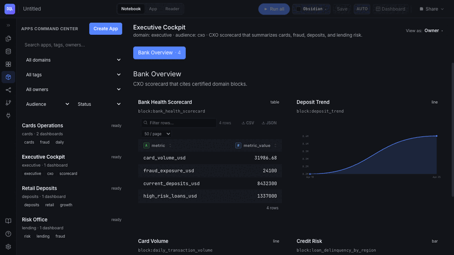
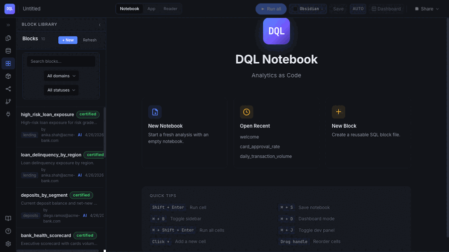
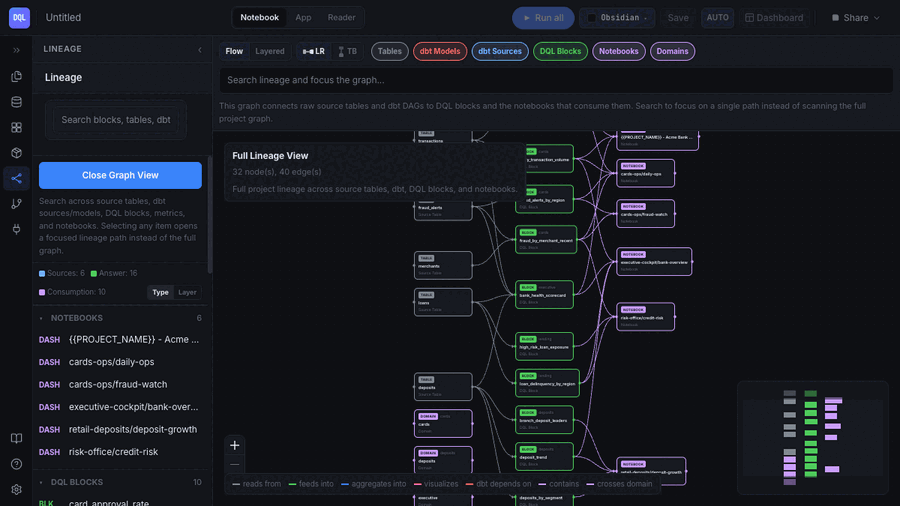

# DQL

[](https://github.com/duckcode-ai/dql/actions/workflows/ci.yml)
[](https://www.npmjs.com/package/@duckcodeailabs/dql-cli)
[](./LICENSE)
[](https://nodejs.org)

**Governed analytics for the agentic era — the answer layer where dbt stops.**
Certified blocks, Apps, end-to-end lineage, and AI answers that cite their
sources. Git-native, local-first, on your laptop.

## Why we built DQL

dbt solved governance for **models**: transformations are code-reviewed,
tested, versioned, and owned. But the place where data actually meets a
decision — the query behind a dashboard tile, the metric pasted into Slack,
the SQL an AI assistant just improvised against your warehouse — has none of
that discipline. Every data team lives with query sprawl, dashboards nobody
fully trusts, and now agents confidently generating SQL no one reviewed.

DQL extends the dbt discipline to that last mile. An analytics answer becomes
a **certified block**: one `.dql` file holding the SQL, owner, domain,
description, tests, chart intent, and the context an LLM needs to use it
correctly — tracked in git, certified by a local gate, and connected to
lineage that runs from the dashboard tile back through your dbt DAG to the
source.

When AI enters the picture, certification becomes the contract. DQL's agent
and MCP server answer questions **from certified blocks first**, and cite
them. When no block matches, the proposal is clearly flagged *Uncertified*
and saved as a draft — so the questions your team actually asks become a
review queue, and the good answers get promoted into governed, reusable
blocks. Trusted answers compound; improvised SQL doesn't.

**If you run dbt**, this will feel familiar by design: keep dbt as the source
of truth for models and semantic metrics, add a `./dql` folder to the same
repo, and the rest of your analytics — blocks, dashboards, notebooks, Apps,
agent answers — becomes code too. No new platform, no lock-in: plain files,
your warehouse, your git workflow.

## Highlights

**OSS Apps for decision work** — package dashboard pages, notebooks, AI pins,
drafts, and certified blocks into local-first App folders that stay in git.



**Block Studio with certified blocks** — every block carries owner / domain / tags / `llmContext` / tests, and shows its certification status inline.



**Full-stack lineage** — `Domain → App → Dashboard → Block → metric → dbt model → source`, rendered as an interactive React Flow + dagre graph.



**AI chat + provider setup** — configure OpenAI, Gemini, local Ollama, custom OpenAI-compatible endpoints, Slack, and schedule delivery keys from one Settings surface; missing keys stay optional until selected.


## Get started

DQL adds an analytics layer on top of a dbt project. Two ways in — both end
at the same place. *(Node 20 or 22 LTS.)*

**1 · Start from your own dbt repo**

```bash
cd your-dbt-repo
dbt parse                        # make sure target/manifest.json exists
npx create-dql-app@latest dql    # scaffolds ./dql, auto-wires the dbt project
cd dql
npm install
npm run sync                     # import dbt models + lineage
npm run notebook                 # opens http://127.0.0.1:3474
```

**2 · No dbt repo handy? Clone the example**

[duckcode-ai/jaffle-shop-duckdb](https://github.com/duckcode-ai/jaffle-shop-duckdb)
is a standard dbt + DuckDB project — treat it exactly like your own repo:

```bash
git clone https://github.com/duckcode-ai/jaffle-shop-duckdb.git
cd jaffle-shop-duckdb
./setup.sh                       # venv + dbt seed + dbt build, fully local
npx create-dql-app@latest dql
cd dql
npm install
npm run sync
npm run notebook
```

From the notebook: open **Block Studio** to create a certified block from a
dbt model, add it to a dashboard page in an **App**, then open **Lineage** to
see `source → dbt model → block → dashboard → App` end to end. No dbt at all?
The scaffold also works standalone — DuckDB runs in-memory, so drop a CSV next
to your blocks and query it with `read_csv_auto()`.

> **Want to see the finished result first?** The example repo's
> [`with-dql` branch](https://github.com/duckcode-ai/jaffle-shop-duckdb/tree/with-dql)
> ships a ready-built DQL workspace — 10 certified blocks, an executive App
> dashboard, and full lineage. `git checkout with-dql`, then
> `cd dql && npm install && npm run notebook`. A hands-on `dql/TUTORIAL.md`
> walks you through adding your own block.

**Docker** *(zero local toolchain)*

```bash
git clone https://github.com/duckcode-ai/dql.git && cd dql
docker compose up
```

Notebook on **http://127.0.0.1:3474**. The working directory is mounted at
`/workspace`; folders with a `dql.config.json` open directly, anything else
gets an ignored starter project under `.dql/docker-starter/`. Add
`--profile slack` for the Slack bot or `--profile ollama` for a local LLM
daemon.

DQL OSS is a single-user local workspace. Hosted multi-user governance,
managed secrets, audit logs, approval workflows, and permissions-aware team
retrieval belong to the commercial product.

## Documentation

All docs live in [`docs/`](./docs/) — plain markdown, rendered on github.com.
Start with [docs/README.md](./docs/README.md).

Quick links:

- **[Tutorials — end to end](./docs/tutorials/README.md)** *(getting started, certified blocks, dashboards & Apps, agentic analytics, CI)*
- [Quickstart](./docs/01-quickstart.md) · [Concepts](./docs/02-concepts.md) · [Install](./docs/03-install.md)
- [Import dbt](./docs/guides/import-dbt.md) · [Block Studio](./docs/guides/block-studio.md) · [Author a block](./docs/guides/authoring-blocks.md) · [Troubleshooting](./docs/guides/troubleshooting.md)
- [CLI reference](./docs/reference/cli.md) · [Language reference](./docs/reference/language.md) · [Connectors](./docs/reference/connectors.md)
- [Architecture](./docs/architecture/overview.md) · [Contributing](./docs/contribute/repo-layout.md)

## What's in the box

- **Notebook** — SQL + DQL cells with live results, charts, and params
- **Block Studio** — governed, versioned analytics blocks with lint + certify
- **Apps** — first-class consumption-layer artifact bundling dashboard pages,
  notebooks, AI pins, drafts, local metadata, and schedules for a domain or use
  case
- **Local policy + RLS preview** — optional single-user preview path for
  commercial governance patterns; `@rls("col", "{user.var}")` resolves at
  execution time from the active local persona when configured
- **Agentic analytics** — `@duckcodeailabs/dql-agent` ships a
  local SQLite + FTS5 knowledge graph, Skills, a block-first answer loop, and
  pluggable LLM providers (Claude / OpenAI / Gemini / local Ollama)
- **MCP server** — 10 tools (`search_blocks`, `get_block`, `query_via_block`,
  `list_metrics`, `list_dimensions`, `lineage_impact`, `certify`,
  `suggest_block`, `kg_search`, `feedback_record`)
- **Slack front-end** — `dql slack serve` runs a slash-command
  bot answering via the same block-first loop, with feedback buttons that
  feed self-learning
- **`dql verify`** — proves `dql-manifest.json` is reproducible
  from source for CI gates
- **Semantic layer** — import dbt metrics/dimensions; author your own
- **Lineage DAG** — Domain · App · Dashboard · Block · metric · dbt model · source granularity with impact analysis
- **Git-native format** — canonical `.dql` serialization, `dql diff`, in-app git panel
- **15 connectors** — Postgres, DuckDB, Snowflake, BigQuery, Redshift, MySQL, and more
- **VS Code extension** — syntax, snippets, LSP (`code --install-extension dql.dql-language-support`)

## What this repo does **not** include

Real authentication (login screens, OIDC, password storage), hosted/multi-tenant
deployment, enforced organization RBAC, governed secrets, audit logs, and
managed approval workflows live outside OSS. Local persona/policy preview,
agentic block generation, MCP runtime, and scheduled runs are included in OSS.

## Privacy & telemetry

Telemetry is **off by default** and collects **no PII** — no file names, query
contents, warehouse URLs, or block names, ever. If you enable it with
`dql telemetry on`, DQL sends only anonymized event names, enum-valued
counters, and durations. Opt out anytime with `dql telemetry off`,
`DO_NOT_TRACK=1`, or `DQL_TELEMETRY_DISABLED=1`. The full event schema is
documented in the [dql-telemetry README](./packages/dql-telemetry/README.md).

## Contributing

See [CONTRIBUTING.md](./CONTRIBUTING.md) and [docs/contribute/repo-layout.md](./docs/contribute/repo-layout.md). Bugs and feature requests: [open an issue](https://github.com/duckcode-ai/dql/issues).

## License

[Apache-2.0](./LICENSE).
