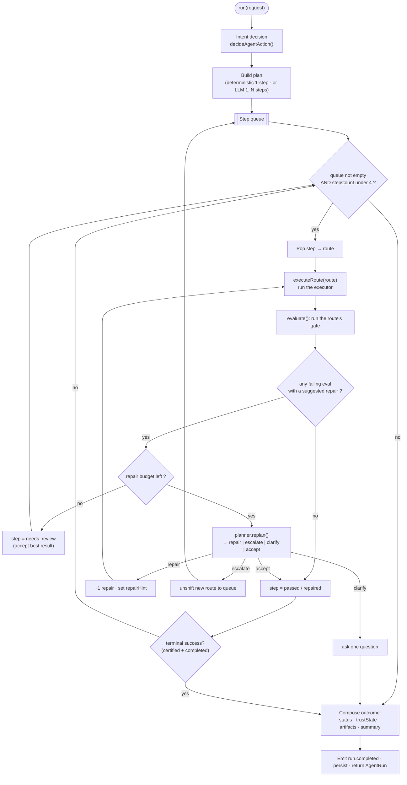
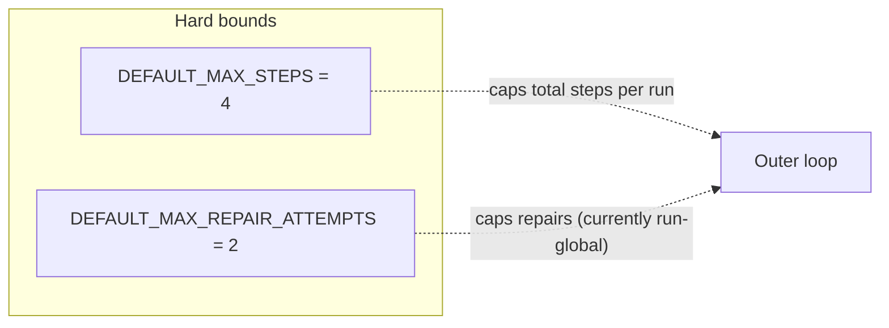

# 1 · The Control Loop — how it loops

> `packages/dql-agent/src/agent-run-engine.ts` (`AgentRunEngine.run()`)

DQL's loop is a **plan-and-execute controller with failure-driven replanning** — the pattern the
2025–2026 literature calls a *Reflexion-style outer supervisor*. It is deliberately **not** a flat
ReAct loop: the supervisor (plan, gate, repair, escalate, budgets, audience constraints) is the
governance layer that a flat loop would throw away.

## The shape

## Step by step

1. **Intent decision** — `decideAgentAction()` classifies the question (deterministic, no LLM) into
   `answer | clarify | investigate | compose_app`. See [Intent & routing](./02-intent-and-routing.md).
2. **Plan** — by default a **single-step deterministic plan** derived from the route decision. In
   `auto` mode an **LLM planner** may decompose into 1–N ordered steps (each step is one route + goal +
   success criteria); on any LLM failure it falls back to the deterministic planner.
3. **Per-step inner loop** — for each planned step: `executeRoute` → `evaluate` (the gate) → decide.
   - A gate returns `AgentRunEvaluation[]`, each with `passed`, `severity` (`info | warning |
     blocking`), an optional `suggestedRepair`, and a machine `repairAction` (`retry` | `escalate`).
   - **Pass** → the step is `passed` (or `repaired` if it took an attempt).
   - **Fail + repairable + budget left** → `replan()` decides **repair** (same route, corrected SQL +
     a hint), **escalate** (switch to a deeper route, e.g. `generated_answer → research`), **clarify**,
     or **accept**.
4. **Escalation** unshifts a new route onto the queue (it does not consume the step budget the same
   way a repair does). The hard-coded escalation map: `certified_answer → research`,
   `generated_answer → research`, `app_build → dql_block_draft`.
5. **Terminal success** (a certified answer completing) breaks the outer loop early; otherwise the
   loop advances to the next queued step.
6. **Finalize** — compose the final `status`, `trustState`, `artifacts`, and `summary`, emit a
   `run.completed` event, persist to the agent-run store, and return the `AgentRun`.

## The budgets (why it can't run away)

- **Max 4 steps** per run.
- **Repairs are budgeted.** Today the budget is **run-global** (2 across all steps). *Known
  follow-up:* make it **per-step** so an early step's repairs can't starve a genuinely repairable
  later step (documented in the code review; the semantic gate that could trigger this was tightened
  to avoid false positives).
- **Escalation is bounded** by the escalation map + the step budget.

## Streaming & events

The loop `emit()`s structured events (`run.started`, `plan.created`, `route.decided`,
`executor.started`, `evaluation.recorded`, `repair.attempted`, `escalated`, `run.completed`, …). The
notebook streams these into the live activity indicator (the orb + Plan → Work → Verify tracker in
`UnifiedAgentRunPanel`).

## Why this shape

| Property | Benefit | Trade-off |
|---|---|---|
| Deterministic default plan | Fast, offline, testable | LLM planner is opt-in for multi-step |
| Per-route executors + gates | Each route is independently testable + governed | Gates must be pre-wired per route |
| Bounded steps + repairs | No runaway cost | Very deep investigations are capped at 4 steps |
| Escalation map | Predictable "answer → research" fallback | Not adaptive/probabilistic |

**Design invariant:** the executor **proposes**; the gates + trust composition **verify**. The loop
never certifies its own output.

→ Next: [Intent & routing](./02-intent-and-routing.md)
