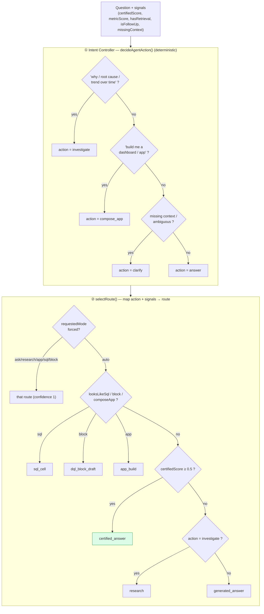
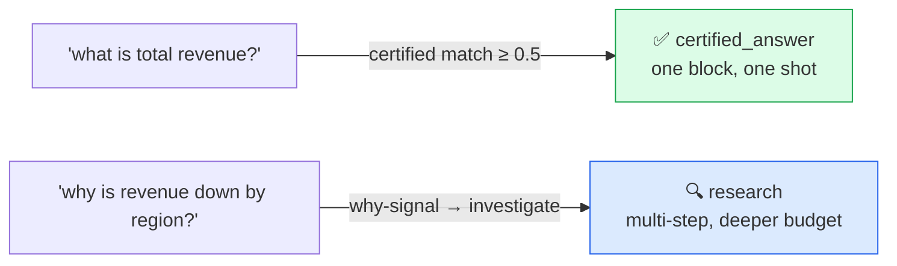
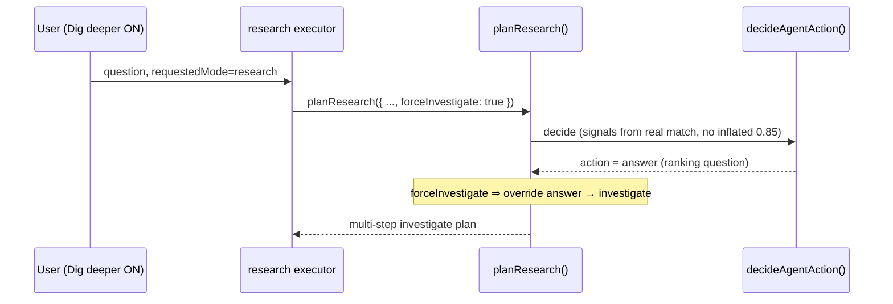

# 2 · Intent & Routing — how it decides what to build

> `packages/dql-agent/src/intent-controller.ts` · `agent-run-engine.ts` (`selectRoute`) ·
> `research-loop.ts`

Before any LLM call, DQL **classifies** the question deterministically and picks a **route**. This is
what keeps a fast lookup fast and sends a genuine investigation deep — without making the user choose.

## Two-stage decision

## The routes

| Route | What it does | Trust ceiling |
|---|---|---|
| `certified_answer` | Execute a matched certified block / governed metric. **One-shot, fast.** | `certified` |
| `generated_answer` | Ground + write review-required SQL, preview it. | `grounded` → certify |
| `research` | Multi-step grounded investigation (a dossier). | `grounded` → certify |
| `sql_cell` | Author SQL for a notebook cell (analyst). | `review_required` |
| `dql_block_draft` | AI drafts a new certified block (review-required). | `review_required` |
| `app_build` | Compose a dashboard from certified blocks. | per-tile |
| `clarify` | Ask **one** sharp question and stop. | `not_applicable` |

## Depth is route-gated (the cost guard)

The certified path is a single block execution — **fast**. Only `generated_answer` / `research` do
the deeper grounding + preview + gating work. This is why the loop can be both snappy on lookups and
thorough on investigations.

## "Research deeper" — honoring a forced depth

When the user explicitly forces research (the *Dig deeper* toggle → `requestedMode: 'research'`), the
research executor sets **`forceInvestigate`**. Inside `planResearch`, that overrides the inner
decision so it can't silently collapse to a single-step "the governed metric answers this directly."

> This fixed a real defect: a hard-coded `certifiedScore: 0.85` used to flip forced research back to a
> one-step answer. It now derives from the real metric-match score.

## Design notes

- **The intent controller is deterministic** — no LLM, offline-safe, and the same every run. That
  makes routing testable and predictable.
- **`requestedMode` is a hint, not a hard mode** on the stakeholder surface — the UI defaults to
  `auto` and only the *Dig deeper* one-shot toggle nudges depth. (Analyst notebook surfaces still
  expose explicit `sql` / `block` routes.)
- **Certified-first**: a confident certified match always wins over generating fresh SQL.

→ Next: [Search & grounding](./03-search-and-grounding.md)
