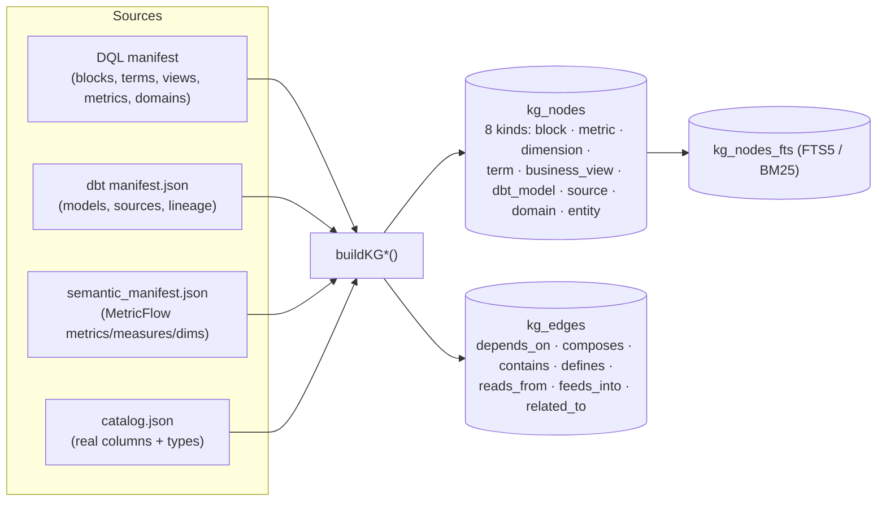
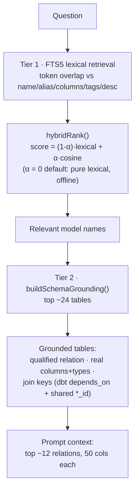
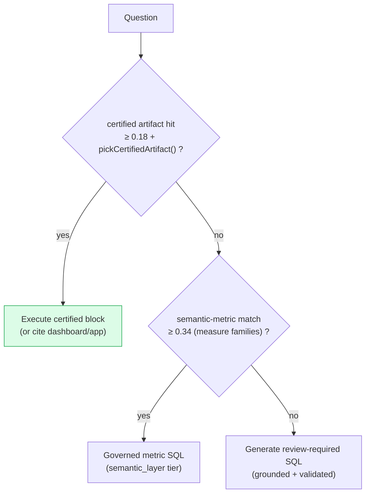
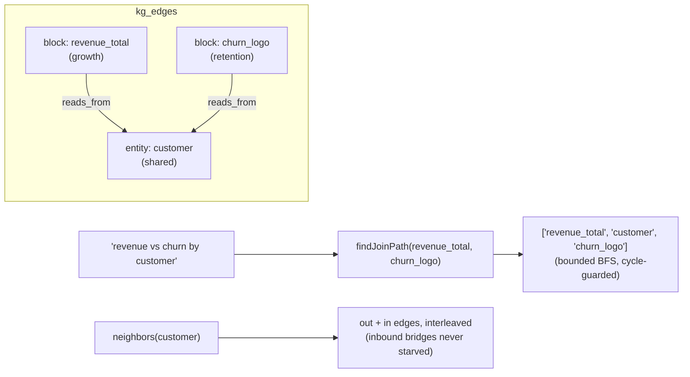

# 3 · Search & Grounding — how it searches

> `packages/dql-agent/src/kg/*` · `metadata/sql-grounding.ts` · `metadata/sql-retrieval.ts` ·
> `metadata/metric-match.ts` · `embeddings/provider.ts`

An LLM writing SQL from a raw schema hallucinates. DQL avoids that by **grounding** every generated
answer in a knowledge graph built from dbt + DQL, and by **schema-linking** only the relevant tables
into the prompt. Accuracy comes from *context*, not a bigger model.

## The knowledge graph

On `dql compile`, DQL builds a knowledge graph into `.dql/cache/agent-kg.sqlite` (SQLite + FTS5).

Each node carries `name`, `domain`, `description`, `llmContext`, `examples`, `grain`, `entities`,
`allowedFilters`, `businessRules`, `certification`, and a data-freshness state.

## Two-tier schema linking (retrieve only what's relevant)

- **Tier 1** ranks candidate models by lexical token overlap (FTS5 / BM25). An **embedding blend**
  exists (`hybridRank`, `HashedTokenEmbeddingProvider`) but defaults to `α = 0` (pure lexical) so the
  OSS path is deterministic + offline. Flip `α > 0` behind config for paraphrase robustness.
- **Tier 2** turns the winners into *grounded tables* — qualified warehouse relations, real columns
  (from `catalog.json`, falling back to manifest YAML), and inferred join keys — and only those go
  into the prompt. Generated SQL is then validated against this context so hallucinated
  relations/columns are caught before execution.

## Routing the answer source

**Metric matching** (`metric-match.ts`) uses *measure families* so "revenue" bridges to
"sales / arr / mrr", plus a name boost, blended through `hybridRank`. A confidence threshold (0.34)
prevents false-positive metric matches.

## Cross-domain reasoning (traversing the graph)

The lineage edges existed but had **no traversal API** — so a question spanning domains ("revenue by
support-ticket-volume") relied on the LLM guessing a join. Two methods now walk `kg_edges`:

- **`neighbors(nodeId, {edgeKinds, direction})`** — adjacent nodes over `kg_edges`, interleaving
  outbound + inbound so a hub entity's inbound cross-domain bridge isn't truncated by a large fan-out.
- **`findJoinPath(from, to, maxDepth)`** — bounded, cycle-guarded BFS returning the node path — the
  join route between two domains.

These are the substrate for the `traverse_domain_graph` tool (see [Tools](./04-tools-and-executors.md)).

## Accuracy levers (grounded in research)

| Lever | Status in DQL |
|---|---|
| Schema linking (retrieve relevant tables) | ✅ two-tier FTS + grounding |
| Certified-first routing | ✅ |
| Few-shot from certified blocks (DAIL-SQL) | ✅ (see [Memory](./07-memory-and-learning.md)) |
| Query-plan before SQL (CoT) | ✅ (see [Self-correction](./06-self-correction.md)) |
| Execution-guided self-correction | ✅ repair loop |
| Semantic-correctness gate | ✅ cardinality (grain/join = roadmap) |
| Cross-domain graph traversal | ✅ substrate (`neighbors`/`findJoinPath`) |
| Embedding retrieval | ⚙️ opt-in (`α > 0`) |

→ Next: [Tools & executors](./04-tools-and-executors.md)
