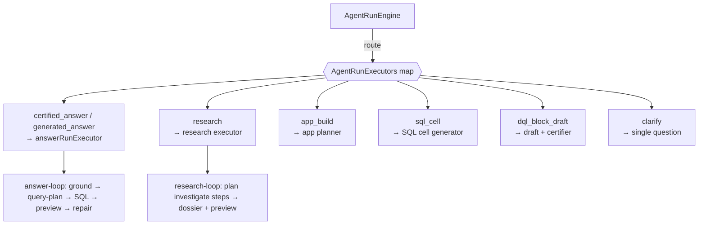
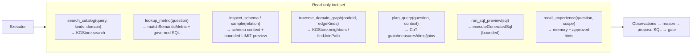
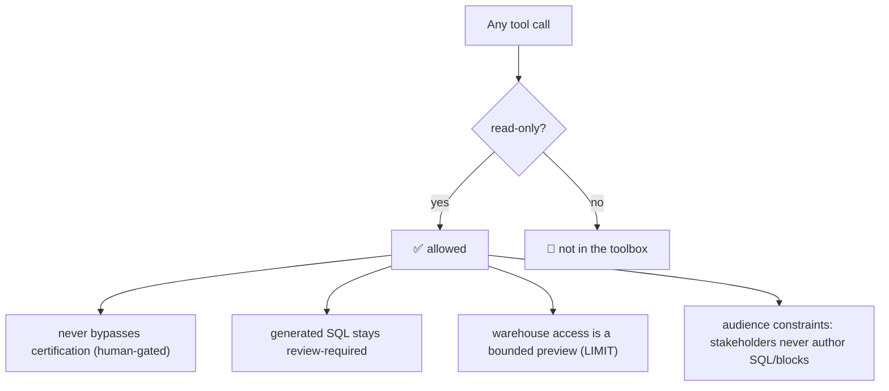

# 4 · Tools & Executors — what it uses to act

> `apps/cli/src/local-runtime.ts` (route executors) · `packages/dql-agent/src/answer-loop.ts` ·
> `research-loop.ts` · `app-planner.ts` · `kg/sqlite-fts.ts` (traversal)

DQL acts through two layers: **route executors** (one per route, injected into the engine) and a set
of **read-only grounding tools** the executors compose. Everything the agent *acts* with is
governed, read-only, and preview-bounded.

## Route executors

Each route in the plan maps to an `AgentRouteExecutor` — a function that receives the question,
intent, prior evaluations, a repair hint, and the step goal, and returns a result + artifacts.

| Executor | Backed by | Output artifact |
|---|---|---|
| `answerRunExecutor` (certified + generated) | `answer-loop.ts` | `answer` (result + SQL + trust) |
| research | `research-loop.ts` + notebook research storage | `research_run` (dossier + result preview) |
| app | `app-planner.ts` | `app_draft` |
| sql cell | grounded SQL gen | `sql_cell` |
| block draft | draft + certifier verdict | `dql_block_draft` |

## The read-only tool registry (the grounding toolbox)

The executors compose a small set of **read-only** tools — each a thin wrapper over code that already
exists. Tools **observe**; they never mutate governed state, never certify, and never write SQL to the
warehouse beyond a bounded preview.

| Tool | Wraps | Purpose |
|---|---|---|
| `search_catalog` | `KGStore.search` (FTS5) | find relevant blocks / metrics / models |
| `lookup_metric` | `matchSemanticMetric` | resolve a governed metric to executable SQL |
| `inspect_schema` / `sample` | schema context + `executeGeneratedSql` (LIMIT) | see real columns + sample values |
| `traverse_domain_graph` | `KGStore.neighbors` / `findJoinPath` | relate entities/models **across domains** |
| `plan_query` | prompt stage | CoT grain + join path **before** SQL |
| `run_sql_preview` | `executeGeneratedSql` | execution-guided check (bounded rows) |
| `recall_experience` | `MemoryStore` + `retrieveScopedHints` | reuse prior corrections/lessons |

## The safety envelope

## Model provider

The LLM itself is a pluggable provider (`pickProvider`): Anthropic, OpenAI, Gemini, **Ollama**
(local), or custom-OpenAI-compatible — each with optional base-URL for enterprise gateways. When no
provider is available, the deterministic paths still work (templated SQL + deterministic planner), so
the loop degrades gracefully offline.

## Current vs roadmap

- ✅ **Route executors** — fully wired; the engine calls them per step.
- ✅ **Grounding tools' building blocks** — all exist (`KGStore.search`/`neighbors`/`findJoinPath`,
  `matchSemanticMetric`, `executeGeneratedSql`, memory/hints).
- ⚙️ **Iterative ReAct tool-loop** — the executor currently proposes SQL largely one-shot then
  repairs; converting `generated_answer`/`research` into a bounded 2–3 iteration
  `plan → search → inspect → preview → reflect` loop is the documented next increment (kept out of the
  one-shot path to avoid regressing what works).

→ Next: [Evaluation & trust](./05-evaluation-and-trust.md)
