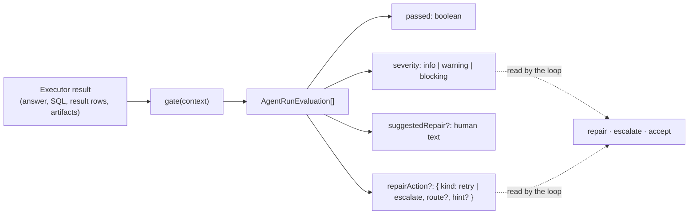
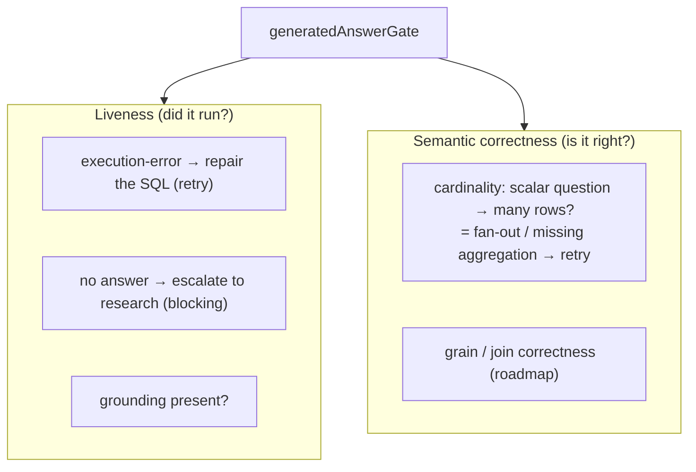
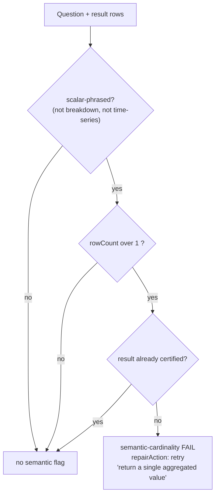
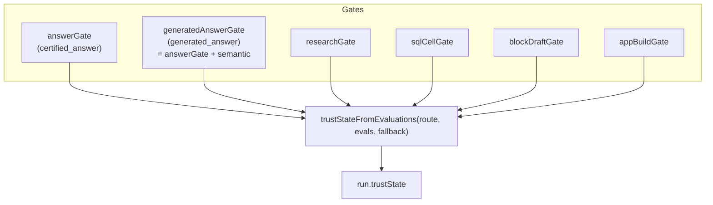
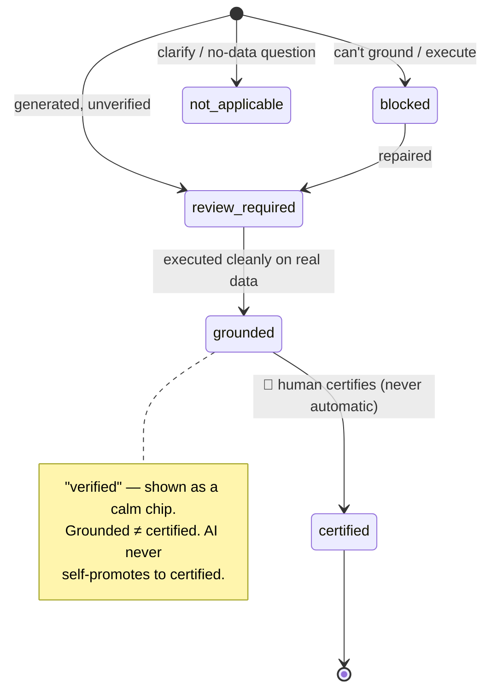

# 5 · Evaluation & Trust — how it checks its own work

> `packages/dql-agent/src/agent-run-gates.ts` · `agent-run-engine.ts` (`trustStateFromEvaluations`)

Every step is graded by an **executable gate** — a pure function that inspects the executor's result
and returns evaluations with a severity and, when actionable, a machine repair action. The gates are
what turn "the LLM said something" into "we verified it, and here's how much to trust it."

## Gate anatomy

## Two kinds of checks: liveness + correctness

Liveness-only gates let *wrong-but-runnable* SQL pass. The **semantic-correctness gate** closes that
gap for the most common error: a **scalar** question ("what is total revenue?") that returns **many
rows** is almost always a fan-out join or a missing `GROUP BY` — it's flagged and repaired.

**Guards against false positives** (so it never wastes a repair on a correct answer):
- **Breakdown** questions ("top customers", "by region", "who…") → excluded.
- **Time-series / window** phrasings ("monthly total revenue", "running total", "month over month")
  → excluded (they are legitimately multi-row).
- **Certified** results → never second-guessed.
- Runs on `generated_answer` only — **not** on research (whose result is a bounded preview, not a
  true row count).

## Gate → trust map

`trustStateFromEvaluations`:
- any **blocking** failed eval → `blocked`
- route `certified_answer` → `certified`
- route `clarify` → `not_applicable`
- route `research` / `generated_answer` **AND** `catalog-grounding` passed **AND** `result-executed`
  passed → **`grounded`**
- else → the route's fallback (usually `review_required`).

## The trust ladder

| State | Meaning | UI |
|---|---|---|
| `certified` | Answered from a governed metric you can trust | green shield "certified" |
| `grounded` | Verified against real data, pending certification | accent shield **"verified"** |
| `review_required` | Generated from governed data, not a metric yet | amber "review required" |
| `blocked` | Couldn't ground/execute it | red "blocked" |
| `not_applicable` | Clarify / not a data question | muted |

> This is the **graduated-trust** contract: the loop can *verify* (grounded) but only a human can
> *certify*. See also `docs/architecture/graduated-trust.md`.

→ Next: [Self-correction](./06-self-correction.md)
