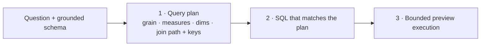
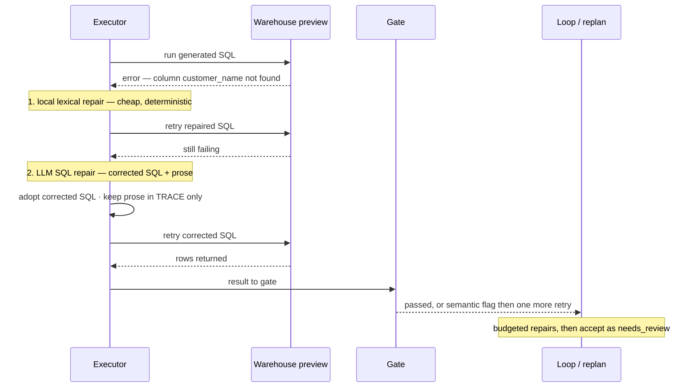
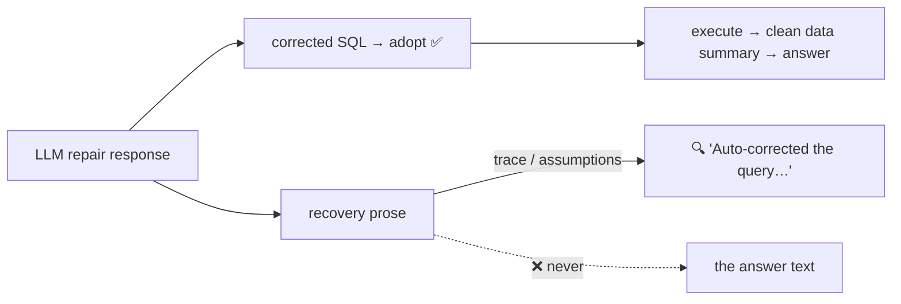
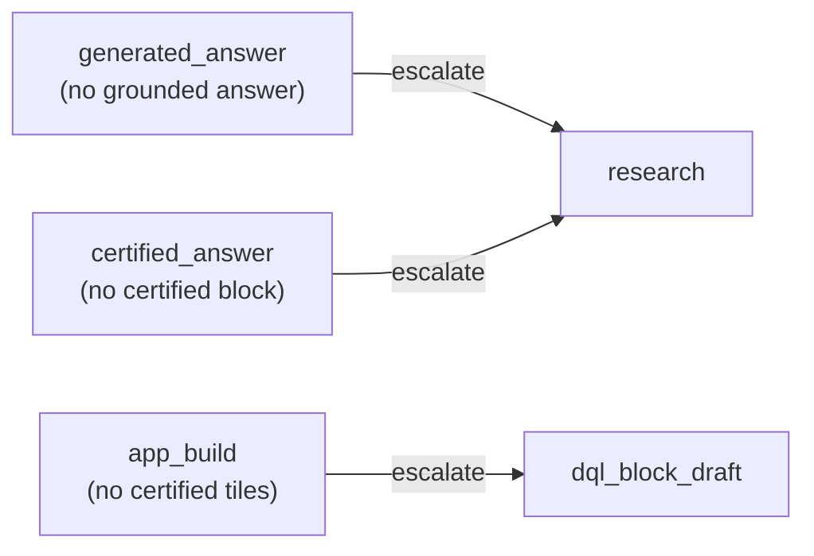
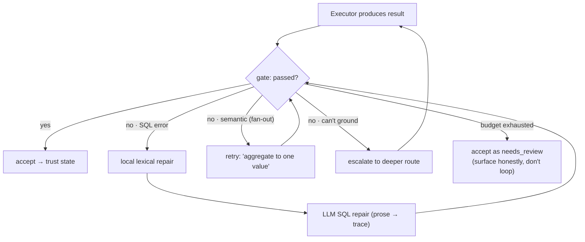

# 6 · Self-Correction — how it corrects errors

> `packages/dql-agent/src/answer-loop.ts` (query-plan + repair) · `agent-run-engine.ts` (replan /
> escalate) · `agent-run-gates.ts`

DQL corrects itself at three layers: **prevention** (a query-plan before SQL), **execution-guided
repair** (fix the SQL from the real error), and **escalation** (switch to a deeper route). Crucially,
the *recovery reasoning stays in the trace* — it never leaks into the answer the user reads.

## Prevention — query-plan before SQL (CoT)

The SQL-generation prompt requires the model to state its plan **before** writing SQL: the **grain**
(one row per what), the **measures** + aggregation, the **dimensions/filters**, and the exact **join
path + keys**. Reasoning about grain and joins up front is the single cheapest accuracy lever in the
text-to-SQL literature — it prevents wrong-grain answers and fan-out joins at the source.

## Execution-guided repair loop

**The critical invariant — recovery reasoning never becomes the answer.** When the LLM repairs the
SQL it also emits error-recovery prose ("the column X was not recognized… I updated the query to use
Y"). That prose is captured as a **`repairNarrative`** and surfaced in the **trace / analysis plan**,
**not** as `parsed.text`. The answer the user sees stays a clean, data-first summary of the corrected
result.

> This fixed the exact repro where "who are the top customers?" showed the error narrative instead of
> the ranked customers. Now: clean summary + the real table.

## Escalation — switch route when repair can't help

If a step's failure isn't SQL-repairable (e.g. no answer could be grounded at all), the gate emits a
**blocking** eval with an `escalate` action. The loop switches to a deeper route.

## The full correction ladder

## What makes this *governed* self-correction

| Property | Why it matters |
|---|---|
| Recovery prose → trace, not answer | The user reads results, not the agent's debugging |
| Execution-guided (real error → fix) | Corrections are grounded in what the warehouse actually said |
| Bounded repairs | No infinite loops or runaway cost |
| Semantic gate drives a repair | Catches *wrong-but-runnable* SQL, not just crashes |
| Escalation is mapped, not random | Predictable "answer → research" deepening |

→ Next: [Memory & learning](./07-memory-and-learning.md)
