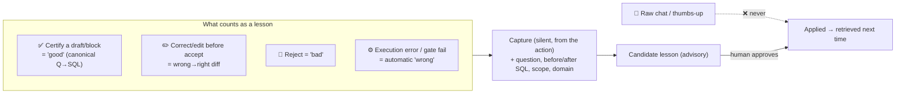
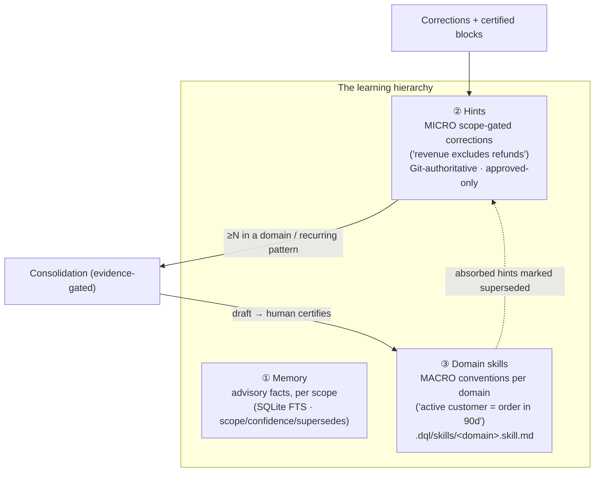
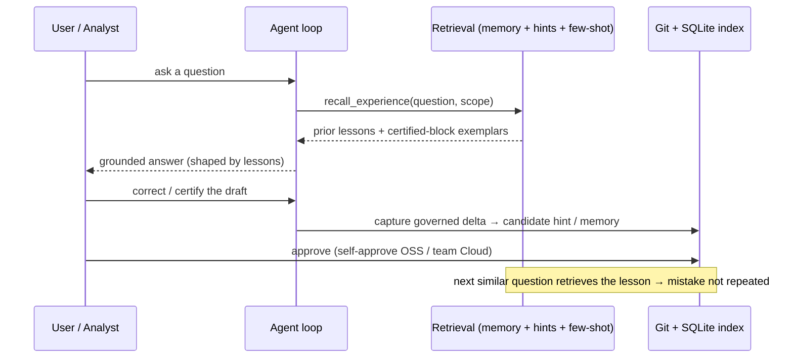
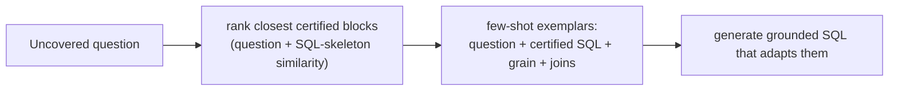
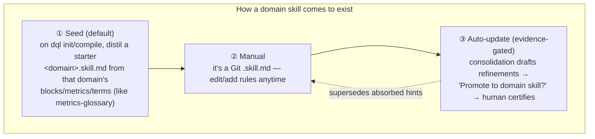
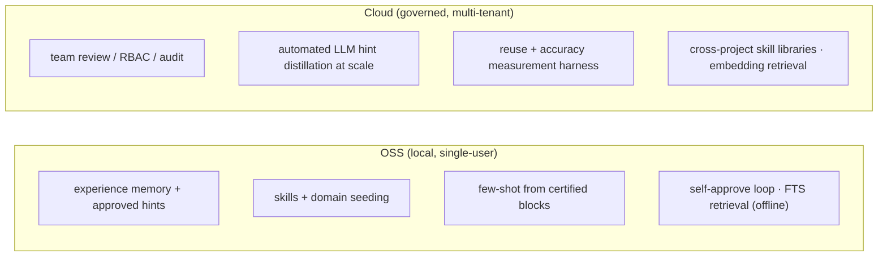

# 7 · Memory & Learning — how it remembers and improves

> `packages/dql-agent/src/memory/sqlite-memory.ts` · `hints/*` · `skills/loader.ts` ·
> `skills/defaults.ts` · `metadata/catalog.ts`

DQL learns like an analyst, not like a chatbot. It **never learns from raw chat** — a question is not
a correctness signal. It learns only from **governed deltas**: the actions a human already takes
(certify, correct, reject) plus execution/gate outcomes. Those carry an unambiguous label *with
context*.

## The learning signal — governed actions, not chat sentiment

- **Capture is silent, from strong actions** — no separate "rate this" step; the *act* of correcting
  or certifying *is* the label. An optional one-line reason becomes the lesson's rationale.
- **Application is human-gated** — a captured lesson stays a **candidate** until approved
  (**self-approve** in OSS single-user; **team review** in Cloud). That gate stops a bad auto-lesson
  from silently changing behavior.

## Three learning altitudes (promotion, not duplication)

| Tier | Grain | Fires on | Storage |
|---|---|---|---|
| **Memory** | a fact | scope match | `.dql/cache/agent-memory.sqlite` + `.dql/memory/*.md` |
| **Hints** | one correction | exact scope (metric/model/domain/dialect/term/block) | `.dql/hints/*.yaml` (Git) + FTS index |
| **Domain skills** | a convention | whole domain | `.dql/skills/*.skill.md` (Git, editable) |

## The closed loop

## Few-shot from certified blocks (DAIL-SQL)

Your certified blocks already **are** a curated question→SQL bank. For an uncovered question, the
closest certified blocks are retrieved and passed as **few-shot exemplars** — the model is told to
*learn their patterns and adapt, not copy*. Every block you certify makes the next uncovered answer
better.

## Domain-skill creation — seeded from structure, not guessed

- **Seeded from your declared DQL domains** (which map to your dbt folders/groups + the semantic
  layer) — deterministic, not a guess.
- **Always human-editable** (Git `.skill.md`, PR-able).
- **Auto-*proposed*** updates as learning accumulates — but **AI drafts, humans certify** (the DQL
  invariant), never a silent write.

Skills already ship as editable starters (`metrics-glossary`, `sql-conventions`, `domain-rules`,
`block-authoring`) via `seedDefaultSkills`; they are selected per question by lexical relevance and
folded into the generation prompt.

## Open-core boundary

The moat was never "having hints" — it is the **governed system around them** (team review,
measurement, cross-project learning). The local self-approved loop drives OSS adoption; the governed,
measured loop is the commercial product.

## Why this beats generic agent memory

- **Scope-gated** by `HintScope` (domain/metric/grain/dbtModel/dialect/term) — "revenue excludes
  refunds" fires only on revenue questions and never leaks into a headcount query.
- **Execution-grounded** — lessons come from what the warehouse + gates verified, not chat vibes.
- **Confidence + decay + `supersedes`** — stale lessons fade; the newest correction wins.

← Back to the [master overview](./README.md)
