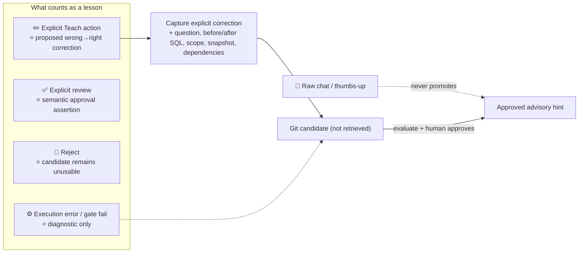
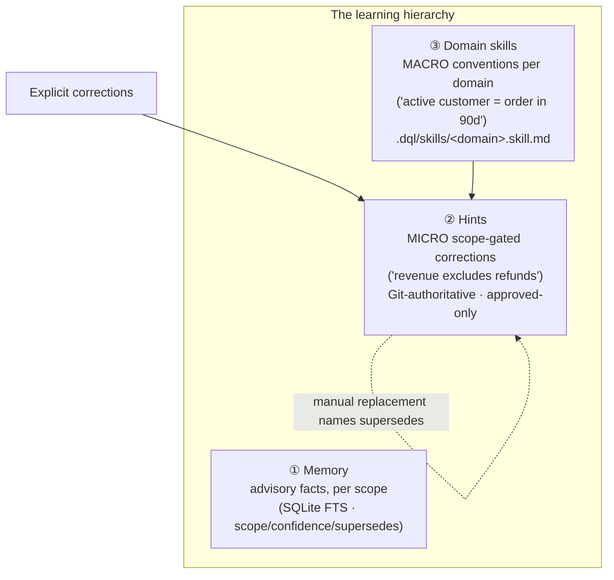
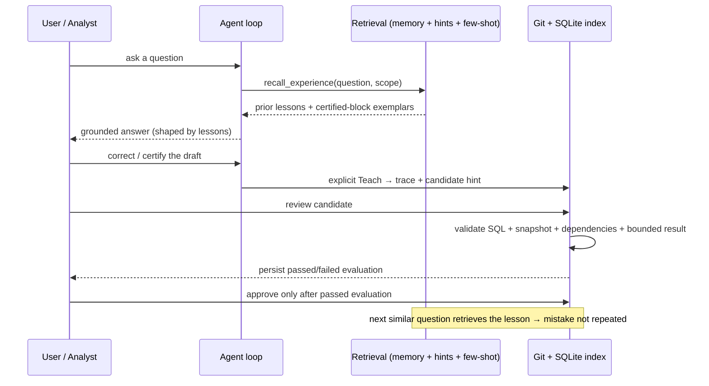
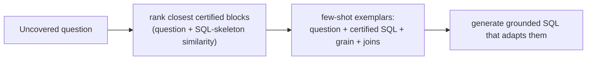
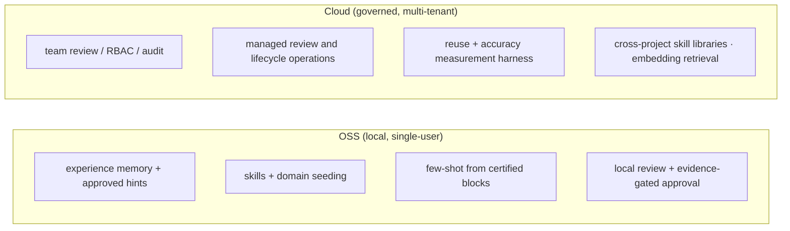

# 7 · Memory & Learning — how it remembers and improves

> `packages/dql-agent/src/memory/sqlite-memory.ts` · `hints/*` · `skills/loader.ts` ·
> `skills/defaults.ts` · `metadata/catalog.ts`

DQL does not treat raw chat, a thumb, an execution error, or a successful query as truth. The shipped
learning path is narrower: an analyst explicitly records a correction, DQL stores it as a
Git-versioned candidate, and a later review runs the governed evaluation before approval. Runtime
errors and feedback remain diagnostics; they do not create or promote hints automatically.

## The learning signal — governed actions, not chat sentiment


```mermaid
flowchart LR
    subgraph Signals["What counts as a lesson"]
        A["✏️ Explicit Teach action<br/>= proposed wrong→right correction"]
        B["✅ Explicit review<br/>= semantic approval assertion"]
        C["🚫 Reject<br/>= candidate remains unusable"]
        D["⚙️ Execution error / gate fail<br/>= diagnostic only"]
    end
    E["💬 Raw chat / thumbs-up"] -.->|"never promotes"| L
    A --> CAP["Capture explicit correction<br/>+ question, before/after SQL, scope, snapshot, dependencies"]
    CAP --> CAND["Git candidate (not retrieved)"]
    CAND -->|"evaluate + human approves"| L["Approved advisory hint"]
    D -.-> CAND
```

- **Capture is explicit** — Ask or Notebook AI opens a transient draft in the Notebook with its
  original question and generated SQL/DQL provenance. After the analyst changes that draft and runs
  it successfully, the notebook's Teach action (or the equivalent API/MCP tool) records the
  correction. Editing, running, rating, saving, or certifying elsewhere does not silently create a
  hint. Saved/certified DQL follows draft review and recertification instead of Teach.
- **Application is human- and evidence-gated** — a candidate is never retrieved. In a dbt-first v3
  project, approval reruns current SQL/context checks, verifies the original snapshot and
  content-addressed dependencies, and performs bounded execution when the local runtime is
  available. The human approval is the semantic assertion; execution success alone is insufficient.
- **Failure is durable and retryable** — failed evaluations and lifecycle errors remain in Git. The
  candidate can be corrected and evaluated again; no endpoint fabricates an approved response.

## Three learning altitudes (promotion, not duplication)


```mermaid
flowchart TD
    subgraph Tiers["The learning hierarchy"]
        M["① Memory<br/>advisory facts, per scope<br/>(SQLite FTS · scope/confidence/supersedes)"]
        H["② Hints<br/>MICRO scope-gated corrections<br/>('revenue excludes refunds')<br/>Git-authoritative · approved-only"]
        S["③ Domain skills<br/>MACRO conventions per domain<br/>('active customer = order in 90d')<br/>.dql/skills/&lt;domain&gt;.skill.md"]
    end
    COR["Explicit corrections"] --> H
    S --> H
    H -.->|"manual replacement names supersedes"| H
```

| Tier | Grain | Fires on | Storage |
|---|---|---|---|
| **Memory** | a local advisory fact | scope match | `.dql/cache/agent-memory.sqlite` (ignored cache) |
| **Hints** | one governed correction | exact scope (metric/model/domain/dialect/term/block) | `.dql/hints/*.hint.yaml` plus Git traces/evaluations/reviews |
| **Domain skills** | a convention | whole domain | `.dql/skills/*.skill.md` (Git, editable) |

Hints are not mirrored into advisory memory. Git is authoritative; the
`.dql/cache/agent-kg.sqlite` index is rebuildable.

### The Hint Graph projection

Each hint is a governed node in the rebuildable `agent_hints` index. DQL also
materializes typed `agent_hint_edges` from the hint's reviewed scope, dependency
fingerprints, lifecycle provenance, and parsed corrected SQL:

```text
hint
├─ belongs_to_domain → domain
├─ refines_metric → metric
├─ uses_dbt_model → dbt model
├─ uses_relation → warehouse/dbt relation
├─ uses_column → qualified relation.column
├─ derived_from → correction trace
├─ validated_by → evaluation
└─ supersedes → older hint
```

These edges share `.dql/cache/agent-kg.sqlite` with the project KG but remain in
their own adjacency table. This preserves the trust order: candidate hints are
reviewable but never enter normal KG search, and approved hints are still folded
in only after certified routing.

The Git hint set and projection schema are content-addressed. On Notebook
startup, DQL compares that fingerprint with the local SQLite projection and
rebuilds it when missing or changed. Therefore an OSS clone receives the shared
governed history from Git without committing or copying `.dql/cache`; an
unchanged project keeps its current local index.

For a new question, explicit domain/metric/model/term/block overlap can recall an
approved hint even when the wording differs. Relation and column overlap then
ranks and explains the match. Relation or column overlap alone cannot make a
hint applicable; every declared scope field must still match, and current
dependency fingerprints must pass. This lets a reviewed rule such as "revenue
uses net amount and excludes refunds" transfer from revenue-by-customer to
revenue-by-region without leaking into customer-count or headcount questions.

## The closed loop


```mermaid
sequenceDiagram
    participant U as User / Analyst
    participant L as Agent loop
    participant R as Retrieval (memory + hints + few-shot)
    participant G as Git + SQLite index

    U->>L: ask a question
    L->>R: recall_experience(question, scope)
    R-->>L: prior lessons + certified-block exemplars
    L-->>U: grounded answer (shaped by lessons)
    U->>L: correct / certify the draft
    L->>G: explicit Teach → trace + candidate hint
    U->>G: review candidate
    G->>G: validate SQL + snapshot + dependencies + bounded result
    G-->>U: persist passed/failed evaluation
    U->>G: approve only after passed evaluation
    Note over G,R: next similar question retrieves the lesson → mistake not repeated
```

## Few-shot from certified blocks (DAIL-SQL)

Your certified blocks already **are** a curated question→SQL bank. For an uncovered question, the
closest certified blocks are retrieved and passed as **few-shot exemplars** — the model is told to
*learn their patterns and adapt, not copy*. Every block you certify makes the next uncovered answer
better.


```mermaid
flowchart LR
    Q["Uncovered question"] --> RANK["rank closest certified blocks<br/>(question + SQL-skeleton similarity)"]
    RANK --> FEW["few-shot exemplars:<br/>question + certified SQL + grain + joins"]
    FEW --> GEN["generate grounded SQL that adapts them"]
```

## Domain skills are separate governed source

Skills ship as Git-editable source and are selected per question. The Hint Graph does not
automatically consolidate corrections into skills or edit dbt/domain/block source. Any promotion is a
separate, explicit authoring and review action.

Skills already ship as editable starters (`metrics-glossary`, `sql-conventions`, `domain-rules`,
`block-authoring`) via `seedDefaultSkills`; they are selected per question by lexical relevance and
folded into the generation prompt.

## Open-core boundary


```mermaid
flowchart LR
    subgraph OSS["OSS (local, single-user)"]
        O1["experience memory + approved hints"]
        O2["skills + domain seeding"]
        O3["few-shot from certified blocks"]
        O4["local review + evidence-gated approval"]
    end
    subgraph Cloud["Cloud (governed, multi-tenant)"]
        C1["team review / RBAC / audit"]
        C2["managed review and lifecycle operations"]
        C3["reuse + accuracy measurement harness"]
        C4["cross-project skill libraries · embedding retrieval"]
    end
```

OSS remains local-first, single-user, dbt-first, and Git-versioned. Managed multi-tenancy, SSO/RBAC,
centralized audit, managed secrets, and approval workflows are future commercial scope, not behavior
implemented by this local lifecycle.

## Why this beats generic agent memory

- **Scope-gated** by `HintScope` (domain/metric/grain/dbtModel/dialect/term) — "revenue excludes
  refunds" fires only on revenue questions and never leaks into a headcount query.
- **Evidence-grounded** — read-only SQL, authorized relations, current snapshots/dependencies,
  bounded execution where available, result shape, and explicit human semantic review are recorded.
- **Fail-closed retrieval** — stale, explicitly superseded, and unresolved conflicting hints are
  withheld. No confidence-decay mechanism silently changes authority.

← Back to the [master overview](./README.md)
