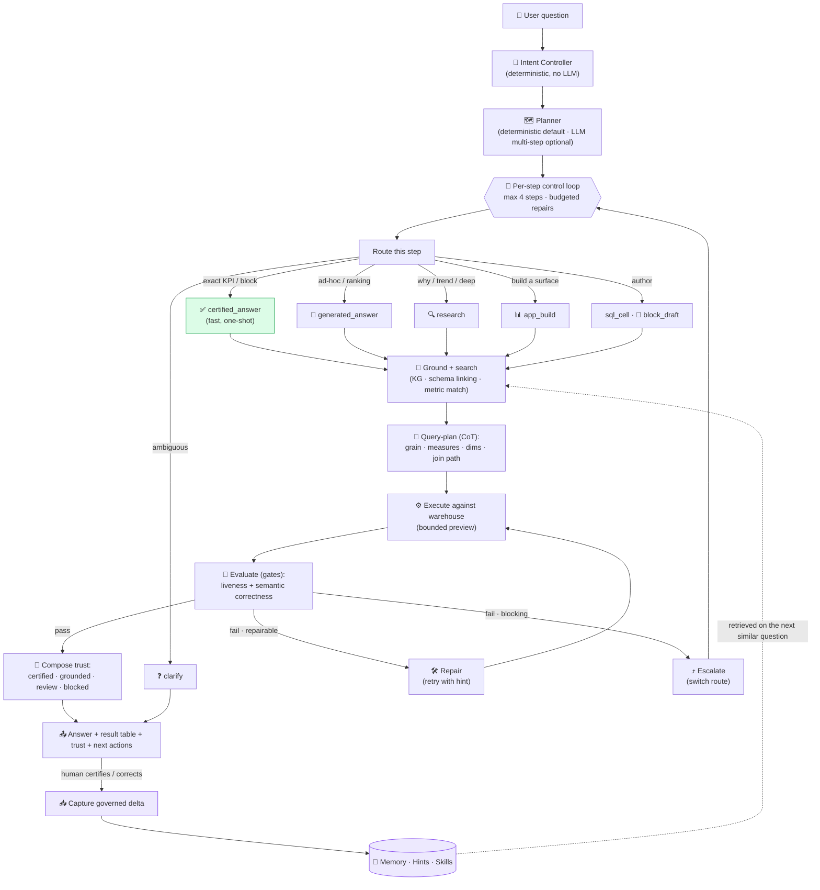
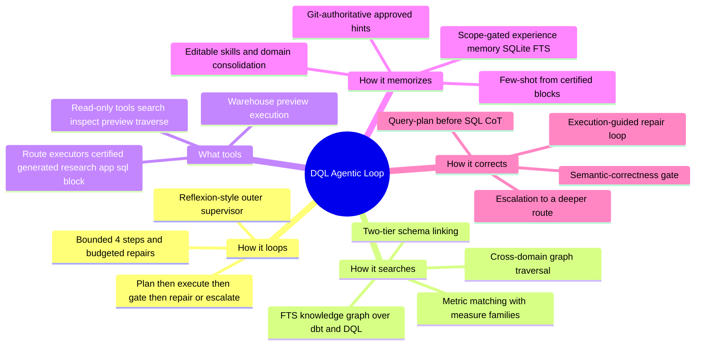
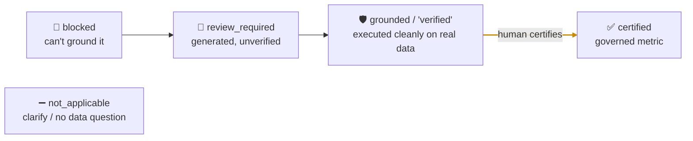

# The DQL Agentic Analyst Loop

> How DQL turns a natural-language question into a **governed, grounded, trustworthy** answer —
> and how it searches, uses tools, evaluates, self-corrects, and learns over time.

This folder is the reference for the whole agentic architecture. Start here for the high-level
picture, then follow the links into each concern.

| # | Doc | Answers |
|---|-----|---------|
| 1 | [Control loop](./01-control-loop.md) | **How it loops** — plan → execute → evaluate → repair/escalate |
| 2 | [Intent & routing](./02-intent-and-routing.md) | **How it decides** what kind of answer to build |
| 3 | [Search & grounding](./03-search-and-grounding.md) | **How it searches** — knowledge graph, schema linking, cross-domain traversal |
| 4 | [Tools & executors](./04-tools-and-executors.md) | **What tools it uses** to act |
| 5 | [Evaluation & trust](./05-evaluation-and-trust.md) | **How it checks** its own work + the trust ladder |
| 6 | [Self-correction](./06-self-correction.md) | **How it corrects** — query-plan, repair, escalation |
| 7 | [Memory & learning](./07-memory-and-learning.md) | **How it memorizes** and improves over time |

---

## The thesis in one line

**DQL is a *tiered governed analyst loop*: a Reflexion-style outer supervisor (plan → gate →
repair/escalate) whose executors are grounded in a governed semantic layer, with a
learn-from-experience memory — never a raw text-to-SQL guess, never an auto-certified answer.**

The moat is not "an LLM that writes SQL." It is the **governance scaffolding around it**: certified
blocks, a knowledge graph over dbt + DQL, execution-guided gates, an honest trust ladder, and a
scope-gated learning loop.

---

## Master flow (high level)

**Reading it:** a question is *classified* (no LLM), *planned* into 1–N steps, and each step *routes*
to an executor. Certified matches short-circuit to a fast one-shot answer; everything else is
**grounded** (search the graph, link the schema), **planned** (state grain + joins before SQL),
**executed**, and **gated**. A gate failure drives a bounded **repair** (same route, corrected) or an
**escalation** (a different route). The result carries an **honest trust label**. When a human
certifies or corrects it, the **governed delta** is captured and retrieved on the next similar
question — the loop learns.

---

## The five capabilities the user asked about

---

## The trust ladder (the governing invariant)

Every answer lands on exactly one rung. **AI never auto-promotes to `certified`** — that is always
a human act.

See [Evaluation & trust](./05-evaluation-and-trust.md) for how each rung is decided.

---

## Key source files (the map)

| Concern | File |
|---|---|
| Outer control loop, budgets, escalation | `packages/dql-agent/src/agent-run-engine.ts` |
| Intent classification | `packages/dql-agent/src/intent-controller.ts` |
| Planner (deterministic + LLM) | `packages/dql-agent/src/agent-run-planner.ts` |
| Answer executor (certified → metric → generated SQL, query-plan, repair) | `packages/dql-agent/src/answer-loop.ts` |
| Research executor (investigate / answer / clarify) | `packages/dql-agent/src/research-loop.ts` |
| Evaluation gates (liveness + semantic correctness) | `packages/dql-agent/src/agent-run-gates.ts` |
| Knowledge graph + search + cross-domain traversal | `packages/dql-agent/src/kg/sqlite-fts.ts` |
| Schema linking / grounding | `packages/dql-agent/src/metadata/sql-grounding.ts`, `sql-retrieval.ts` |
| Metric matching | `packages/dql-agent/src/metadata/metric-match.ts` |
| Experience memory | `packages/dql-agent/src/memory/sqlite-memory.ts` |
| Hints (correction → candidate → approve → reuse) | `packages/dql-agent/src/hints/*` |
| Skills | `packages/dql-agent/src/skills/loader.ts` |
| Route executors + wiring | `apps/cli/src/local-runtime.ts` |
| UI (trace, trust chips, result table) | `apps/dql-notebook/src/components/agent/UnifiedAgentRunPanel.tsx` |
