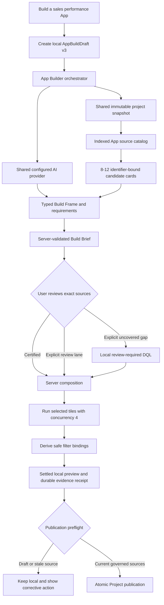

# App AI architecture

DQL has two distinct AI entry points for Apps. **Build with AI** is a dedicated
App Builder orchestrator because it produces a versioned, stateful, multi-source
App. It does **not** reuse Ask AI's end-to-end answer state machine. **App
Autopilot** is the right-side assistant for an already saved App draft; it uses
the universal Ask AI AgentRun lifecycle and provider ledger, then prepares a
small reviewed App operation. Both paths converge on the same typed draft,
Dataset compiler, preview, persistence, and publication gates (`AGT-007`,
`AGT-022`, `AGT-026`).

## Source catalog

`AppSourceCatalogService` is a snapshot-backed projection of every executable
block declaration, including certified, review, draft, pending-recertification,
and optionally deprecated sources. Qualified path-derived IDs prevent same-name
blocks in different domains from collapsing. Search uses descriptions, domains,
tags, fields, filters, parameters, grain, and visualization capabilities. Raw
dbt models remain context and are not executable App tiles.

The HTTP contract is server-paginated (default 50, maximum 100):

- `GET /api/app-builds/:id/source-candidates` performs query/facet/cursor search.
- `POST /api/app-builds/:id/source-candidates` resolves an exact source-ID batch
  against the current snapshot.

Discoverability and eligibility are separate. Draft sources are always visible
and labeled. Under `governed_only`, their Add action is disabled; changing to
`include_review_required` permits local preview without changing trust or
Project-publication eligibility (`PRD-007`, `API-014`, `UI-023`).

## AI planning and composition

The dedicated App Builder orchestrator sends at most 8-12 candidate cards to
one configured provider call. Structured output may reference only supplied
source IDs. The server validates lifecycle, capability, source revision,
snapshot, policy, typed Dataset queries, pages, story sections, filters,
navigation, cross-filters, and detail drills. A deterministic plan is allowed
only when no planner is configured. If a configured planner returns malformed
output or fails, the request surfaces a typed error instead of silently
replacing the provider result with a deterministic App.

AI proposals and their revisions are server-owned local artifacts. Clarification
answers and additional-source selections create a new proposal revision.
Uncovered SQL is never generated implicitly: the user must enable the review
lane and invoke the exact gap action. Manual and AI authoring converge on:

- `POST /api/app-builds/:id/compose`

The browser submits an allow-list. Only the server creates canonical sources,
tile `sourceId` bindings, review tasks, requirement coverage, and the next
atomic draft revision. React never invents trust-bearing source IDs or tiles.

## App Autopilot

The right-side App Autopilot is intentionally separate from initial generation.
It receives opaque draft, page, tile, and optional preview identifiers from the
browser. The runtime reloads the saved draft and current Dataset contract before
the universal AgentRun executor invokes the configured provider. The provider
returns one bounded intent such as a tile grouping or visualization change,
page or tile addition/removal, filter mapping, cross-filter, navigation, detail
drill, or layout arrangement. It can also return context-limited explanation or
repair guidance.

The server compiles that intent into typed `AppBuildDraftOperation` values and
stores an immutable review artifact linked to its AgentRun. Apply requires the
review artifact, draft revision, proposal hash, current source revision, and
Dataset contract to still match. A repeated Apply is idempotent. App Autopilot
cannot receive browser-supplied SQL, source identity, result rows, or arbitrary
operations, and it never mutates the draft before explicit Apply.

An optional preview identifier is never browser evidence. The runtime resolves
it against the saved draft and server-held settled result or failure, then adds
only a bounded governed summary or diagnostic to the provider context. For a
current, small, complete Dataset chart, that summary can include declared safe
group facts and selected measures. It derives a subtotal only when the Dataset
declares the measure additive on the selected grouping axis and does not mark
that specific dimension non-additive; distinct counts, ratios, averages,
incomplete results, and unsafe groups never receive a recomputed total. A
limited query is described as its displayed group set, not
as an unbounded Dataset total. Request classification decides when result or
failed-tile evidence is required; a valid optional preview can also ground
indirect result questions. Missing or stale optional evidence cannot authorize
a result answer and does not block a purely structural change. Before a provider
answer or proposal is retained, the same server-held evidence is validated again
against draft, source, filter, target, persona, and preview generation. Refusals
carry a typed recovery reason. Raw result-row objects, SQL, and browser-supplied
source authority remain outside the provider context.

## AppBuildDraft v3

Lifecycle, trust, and source kind are independent. Every data tile binds one
canonical source and revision. A source stores qualified identity, path,
execution reference, lifecycle, snapshot, source revision/fingerprint, and a
capability snapshot. Aggregate validation rejects duplicate sources, broken
tile references, mismatched revisions, and non-certified governed-only sources.

V2 drafts migrate lazily only when a legacy source resolves uniquely by path
and fingerprint. Missing or ambiguous identities remain visible review blockers.

## Preview, filters, restart, and publication

The local runtime runs up to four components concurrently, preserves component
order in the response, and reports each failure independently. It retains the
shared same-target bounded repair contract. Draft and repaired results remain
review-required.

Filter candidates combine declared source capabilities with columns proven
safe by the settled execution. Exact per-tile bindings are stored; sampled
values are ephemeral. Preview evidence persists in the ignored local SQLite
store so restart does not lose a settled receipt, while result rows remain
ephemeral. Draft revision, source fingerprints, filters, snapshot, and execution
evidence are rechecked during preflight.

Project publication stays atomic and fails closed for draft/review sources,
source drift, gaps, open reviews, unsettled previews, or incomplete filter
bindings. Certification never flows into an App silently: refresh the canonical
binding, review the new revision, rerun, and preflight again.

The committed Project output remains ordinary Git-reviewable `dql.app.json`
and `.dqld` files. Hosted deployment, centralized approvals, RBAC, and managed
multi-user workflow remain outside the OSS boundary.
