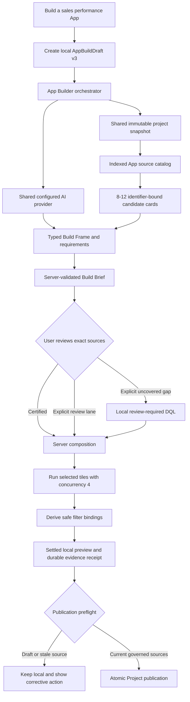

# App AI architecture

DQL App Builder has a dedicated orchestrator because it produces a versioned,
stateful, multi-source App. It does **not** reuse Ask AI's end-to-end answer
state machine. It does reuse the configured provider adapter, immutable project
snapshot, retrieval and meaning infrastructure, execution/repair boundary,
trust vocabulary, and evidence primitives (`AGT-007`, `AGT-026`).

## Source catalog

`AppSourceCatalogService` is a snapshot-backed projection of every executable
block declaration, including certified, review, draft, pending-recertification,
and optionally deprecated sources. Qualified path-derived IDs prevent same-name
blocks in different domains from collapsing. Search uses descriptions, domains,
tags, fields, filters, parameters, grain, and visualization capabilities. Raw
dbt models remain context and are not executable App tiles.

The HTTP contract is server-paginated (default 50, maximum 100):

- `GET /api/app-builds/:id/source-candidates` performs query/facet/cursor search.
- `POST /api/app-builds/:id/source-candidates` resolves an exact source-ID batch
  against the current snapshot.

Discoverability and eligibility are separate. Draft sources are always visible
and labeled. Under `governed_only`, their Add action is disabled; changing to
`include_review_required` permits local preview without changing trust or
Project-publication eligibility (`PRD-007`, `API-014`, `UI-023`).

## AI planning and composition

The App orchestrator sends at most 8-12 candidate cards to one configured
provider call. Structured output may reference only supplied source IDs. The
server validates lifecycle, capability, source revision, snapshot, and policy;
invalid or unavailable provider output falls back to bounded deterministic
composition without upgrading trust.

AI proposals and their revisions are server-owned local artifacts. Clarification
answers and additional-source selections create a new proposal revision.
Uncovered SQL is never generated implicitly: the user must enable the review
lane and invoke the exact gap action. Manual and AI authoring converge on:

- `POST /api/app-builds/:id/compose`

The browser submits an allow-list. Only the server creates canonical sources,
tile `sourceId` bindings, review tasks, requirement coverage, and the next
atomic draft revision. React never invents trust-bearing source IDs or tiles.

## AppBuildDraft v3

Lifecycle, trust, and source kind are independent. Every data tile binds one
canonical source and revision. A source stores qualified identity, path,
execution reference, lifecycle, snapshot, source revision/fingerprint, and a
capability snapshot. Aggregate validation rejects duplicate sources, broken
tile references, mismatched revisions, and non-certified governed-only sources.

V2 drafts migrate lazily only when a legacy source resolves uniquely by path
and fingerprint. Missing or ambiguous identities remain visible review blockers.

## Preview, filters, restart, and publication

The local runtime runs up to four components concurrently, preserves component
order in the response, and reports each failure independently. It retains the
shared same-target bounded repair contract. Draft and repaired results remain
review-required.

Filter candidates combine declared source capabilities with columns proven
safe by the settled execution. Exact per-tile bindings are stored; sampled
values are ephemeral. Preview evidence persists in the ignored local SQLite
store so restart does not lose a settled receipt, while result rows remain
ephemeral. Draft revision, source fingerprints, filters, snapshot, and execution
evidence are rechecked during preflight.

Project publication stays atomic and fails closed for draft/review sources,
source drift, gaps, open reviews, unsettled previews, or incomplete filter
bindings. Certification never flows into an App silently: refresh the canonical
binding, review the new revision, rerun, and preflight again.

The committed Project output remains ordinary Git-reviewable `dql.app.json`
and `.dqld` files. Hosted deployment, centralized approvals, RBAC, and managed
multi-user workflow remain outside the OSS boundary.
