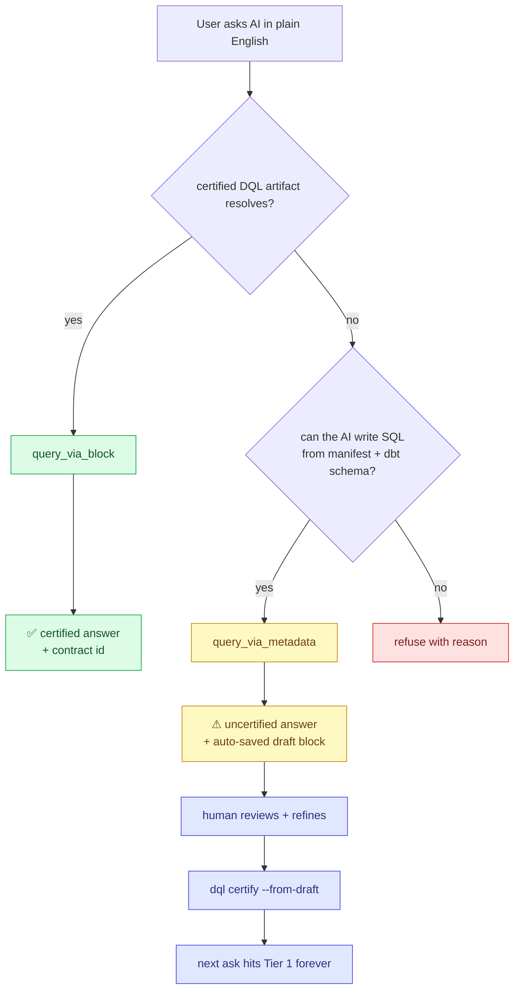

# Graduated trust + the promotion loop

DQL's wedge — *one question, one answer, fully traced* — depends on certified
DQL artifacts. Blocks answer executable data questions; business terms and
business views answer definition/context questions and help route to the right
blocks. But real AI usage isn't strict-only: agents will ask questions for
which no certified block exists yet, and refusing every such ask sends users
to bypass the MCP and write SQL directly. That defeats the wedge.

DQL's answer is **graduated trust**: three tiers the AI agent walks in
priority order, with the trust label always visible to the human.



## Tier 1 — certified DQL context

For data answers, the wedge proper is `query_via_block`. It refuses anything that isn't:

- `status = "certified"`, AND
- `datalex_contract` resolves to a contract in the loaded `datalex-manifest.json`.

Agents ALWAYS try certified project context first. Business terms and
business views can be selected as certified context for definition-style
questions, and they also attach to block answers as evidence. For executable
answers, the result is safe to ship to dashboards because every output column
traces back through the contract → dbt model → source column.

## Tier 2 — `query_via_metadata`

Use when Tier 1 returns no match. The agent supplies the SQL it inferred from
the manifest + dbt schema; the runtime executes it. The result returns with
`uncertified: true` so the human sees the trust label, and the proposal is
auto-captured as a draft block at `blocks/_drafts/<slug>.dql`. Same question
asked again increments the `asked_times` counter on the existing draft —
questions that get asked repeatedly are the strongest candidates for
certification.

```typescript
queryViaMetadata({
  question: "How many active customers in Q1?",
  proposedSql: "SELECT COUNT(DISTINCT customer_id) FROM fct_orders WHERE …",
  proposedDomain: "customer",
  proposedEntity: "Customer",
  upstreamRefs: ["fct_orders"],
})
```

The agent contract: surface `uncertified: true` verbatim to the human, and
mention the path forward — `dql certify --from-draft <path>`.

## Tier 3 — refuse

When the question is unanswerable from any data the project has, the agent
must refuse and say why. Hallucinating an answer breaks the wedge.

## The promotion loop

Tier-2 captures aren't dead-end answers — they're the input to a review
workflow that turns ad-hoc AI proposals into certified contracts.

1. **Capture** — `query_via_metadata` writes a draft block with a
   `_proposed { ... }` provenance block (asking time, asked-times counter,
   proposed domain/entity, suggested contract id).
2. **Surface** — `list_proposals` returns drafts ranked by `asked_times`
   descending. Wire it into a review dashboard or run it in your terminal:
   `mcp call list_proposals --asked-at-least-times 3`.
3. **Refine** — A human edits the SQL, names the contract, sets ownership.
   Standard git workflow — open a PR, request review.
4. **Certify** — `dql certify --from-draft <path>` does the promotion:
    - Moves `blocks/_drafts/<slug>.dql` → `blocks/<domain>/<slug>.dql`
    - Flips `status = "draft"` to `"certified"`
    - Sets `datalex_contract = "<id>@<version>"`
    - Drops the `_proposed` provenance block
    - Surfaces the patch the human still needs to apply to
      `datalex-manifest.json` (so the contract id resolves)
5. **Forever** — Next time the same question is asked, Tier 1 hits. Same
   answer, every time.

Example end-to-end:

```bash
# Step 4 — promote a draft after review
dql certify --from-draft blocks/_drafts/active_customers_by_quarter.dql \
            --domain customer \
            --contract commerce.Customer.active_customers_by_quarter@1 \
            --owner growth@example.com

# Step 5 — refresh the manifest so the new certified block is indexed
dql compile

# Apply the patch the previous step printed to datalex-manifest.json
# (or wait for the DataLex compiler to emit it once the v1 emitter ships).
```

## Why this is in OSS, not commercial

The strategic line — language primitives stay OSS, shared multi-user state
goes commercial — applies cleanly:

- **OSS (in the box today):** Tier-2 capture, draft writer, `dql certify
  --from-draft`, `list_proposals`, single-user review. Uses git as the
  shared store.
- **Commercial (later):** team review queue with assignments, RBAC, audit
  logs, continuous drift monitoring, Slack/email notifications,
  cross-team approval workflows, hosted MCP gateway across teams,
  multi-tenant.

A solo developer can run the whole loop on their laptop. A small team can
coordinate via PRs. The day a 50-person team needs assignments, deadlines,
and audit logs, that's the day they pay.

## Tool-by-tool reference

| Tool | Tier | When to use |
|---|---|---|
| `search_blocks`, `get_block` | discovery | Find Tier-1 candidates before deciding which tool to call |
| `query_via_block` | Tier 1 | Always try first |
| `query_via_metadata` | Tier 2 | Only after Tier 1 returns no match |
| `list_proposals` | review | Surface the ranked draft queue for human triage |
| `suggest_block` | curated draft | Hand-shape a proposal that aggregates over many Tier-2 captures |
| `certify` | governance | Evaluate rules against a block (does NOT promote — see `dql certify --from-draft`) |
| `lineage_impact` | reasoning | Trace upstream/downstream before changing a contract |
| `list_metrics`, `list_dimensions` | semantic | List dbt-semantic metrics + dimensions |
| `kg_search` | semantic | FTS5 search across blocks, metrics, dashboards, apps |
| `feedback_record` | learning | Record thumbs-up/down on answers; feeds promotion priority |

The agent's instructions on session init explicitly document the priority:
"Always try `query_via_block` first. Fall back to `query_via_metadata`. Use
`list_proposals` to see what's queued. Use `dql certify --from-draft` to
close the loop."
