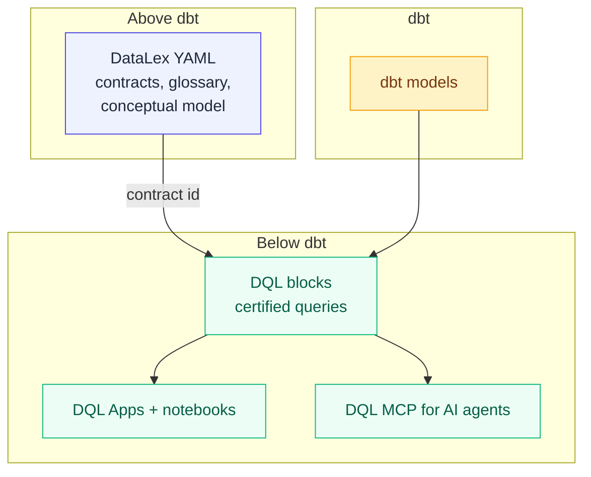

# The DataLex + DQL stack

DQL is one half of a federated open-source stack. **DataLex** sits above dbt and defines business contracts; DQL sits below dbt and serves certified analytics to humans and AI agents. The two languages live in separate repos with separate release cadences, bridged by a public [manifest spec](https://github.com/duckcode-ai/manifest-spec).

This page is the orientation map. For deep dives, follow the links.

---

## The wedge in one sentence

> **One question. One answer. Fully traced — every time.**

Without contracts, the same business question — "what was monthly active customers last quarter?" — gets different numbers from different teams' AI tools. DataLex codifies the definition; DQL's compiler enforces the binding; the DQL MCP refuses to serve uncertified answers; the lineage is traceable from a chart pixel back to the dbt source column.

---

## How the layers compose



| Layer | Purpose | Source of truth |
|---|---|---|
| **DataLex** (above dbt) | Domains, entities, fields, contracts, governance, glossary | [duckcode-ai/DataLex](https://github.com/duckcode-ai/DataLex) |
| **dbt** (middle) | Transformations, model lineage, semantic-layer metrics | dbt Labs |
| **DQL** (below dbt) | Certified blocks, notebooks, Apps, AI MCP | This repo |

---

## How a DQL block binds to a DataLex contract

A certified block declares the contract it implements:

```dql
block "Monthly Active Customers" {
  type = "custom"
  status = "certified"
  datalex_contract = "commerce.Customer.monthly_active_customers@1"
  query = """
    SELECT DATE_TRUNC('month', ordered_at) AS order_month,
           COUNT(DISTINCT customer_id)     AS monthly_active_customers
    FROM   fct_orders
    GROUP  BY 1
  """
}
```

The DataLex contract that backs it lives in your project's `*.model.yaml`:

```yaml
entities:
  - name: Customer
    contracts:
      - id: commerce.Customer.monthly_active_customers
        name: monthly_active_customers
        version: 1
        signature:
          inputs:
            - name: order_month
              type: date
          outputs:
            - name: monthly_active_customers
              type: integer
              constraints: ["positive"]
```

What happens at each stage:

- **`dql compile`** — resolves the reference against the DataLex manifest. Compilation **fails** for `status: certified` if the contract doesn't exist, the version pin is missing, or the reference is malformed. Compilation **warns** for `status: draft|review` (work-in-progress is allowed). Implemented in [`dql-core/src/contracts/`](https://github.com/duckcode-ai/dql/tree/main/packages/dql-core/src/contracts).
- **`dql mcp` `query_via_block`** — refuses to serve any block whose `datalex_contract` doesn't resolve in the project's loaded `datalex-manifest.json`. AI agents only ever get certified, traceable answers. The MCP enforcement check lives in [`dql-mcp/src/tools/query-via-block.ts`](https://github.com/duckcode-ai/dql/blob/main/packages/dql-mcp/src/tools/query-via-block.ts).
- **`dql-openlineage`** — emits OpenLineage events that include the contract id as an upstream dataset, so Marquez, DataHub, Atlan, and Monte Carlo see the binding without depending on either compiler.

---

## End-to-end tutorial (5 minutes)

Both halves of the stack ship pre-built example projects backed by dbt + DuckDB. You don't need anything else installed.

1. **Stage 1 — DataLex contracts.** [`jaffle-shop-DataLex`](https://github.com/duckcode-ai/jaffle-shop-DataLex) — clone, run `dbt build`, open in `datalex serve`, walk the diagrams, review the AI-drafted contract proposals.
2. **Stage 2 — DQL certified blocks.** [`jaffle-shop-dql`](https://github.com/duckcode-ai/jaffle-shop-dql) — `docker compose up`, browse the certified blocks (each cites the DataLex contract it backs), open the Apps Command Center, ask the AI chat a question.
3. **Stage 3 — AI agent integration.** Point Cursor or Claude Code at `dql mcp serve` running in the jaffle-shop project. Same question, same answer, every time — and the `query_via_block` audit log shows which contract version answered.

---

## The manifest spec

DataLex and DQL never depend on each other's internals. They speak through the public schema at [`duckcode-ai/manifest-spec`](https://github.com/duckcode-ai/manifest-spec):

- `schemas/v1/datalex-manifest.schema.json` — DataLex compiler output (consumed by `dql-core`'s `DataLexContractRegistry`).
- `schemas/v1/dql-manifest.schema.json` — DQL compiler output (the artifact this repo emits).
- `docs/interop.md` — the contract-id binding rules and resolution semantics.
- `docs/versioning.md` — SemVer + RFC discipline + 12-month support windows.

Third-party tools build on these schemas without depending on either compiler. That's the moat.

---

## Why federation, not a unified product

The two languages have different audiences (analytics engineers vs. data platform leads), different runtimes (TypeScript vs. Python), and different release cadences. Combining them in one repo would slow both down. Federation via spec is the pattern proven by **dbt's manifest, OpenAPI, and OpenLineage**: shared contracts at the boundary, independent evolution at the implementation. We followed that pattern deliberately.
