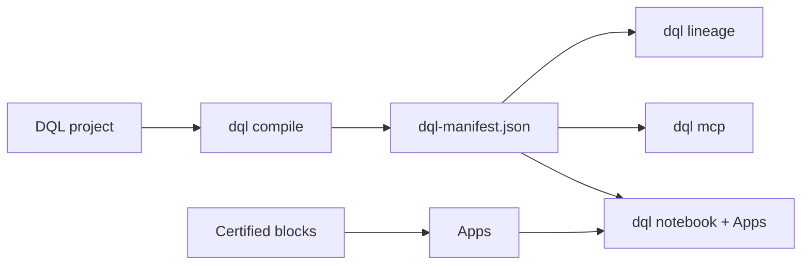

---
hide:
  - navigation
  - toc
---

# DQL

> **Analytics as code for certified reusable blocks, Apps, and dbt-aware lineage.**

DQL OSS is a local-first, single-user workspace for turning analytics work into
git-backed source artifacts. Blocks carry SQL or semantic intent, owner, domain,
description, tests, chart config, and agent context. Apps package certified
blocks into decision-facing dashboard pages and notebooks. `dql compile`
generates a dbt-like manifest with lineage from sources and dbt models through
blocks and Apps.

No hosted account is required. Certification is a local trust label. Personas
and policies are local previews, not hosted RBAC.

## Start Here

From your dbt repo (or clone
[jaffle-shop-duckdb](https://github.com/duckcode-ai/jaffle-shop-duckdb)
and run `./setup.sh` first):

```bash
dbt parse                        # ensure target/manifest.json exists
npx create-dql-app@latest dql    # scaffolds ./dql, auto-wires dbt
cd dql
npm install
npm run sync                     # import dbt models + lineage
npm run notebook                 # http://127.0.0.1:3474
```

Then run:

```bash
npm run compile
npm run lineage
```

## Why DQL

- **Certified blocks.** Save reusable answer units with metadata, tests, and
  local trust status.
- **Apps in git.** Package dashboard pages, notebooks, text, AI pins, and draft
  blocks in local App folders.
- **dbt-aware lineage.** Connect sources, dbt models, semantic metrics, DQL
  blocks, dashboard pages, and Apps in `dql-manifest.json`.
- **Agent-safe defaults.** Local agent and MCP tools prefer certified blocks and
  label fallback generated SQL as uncertified.
- **OSS boundary clarity.** Local single-user workflows are open source; hosted
  auth, managed secrets, audit logs, organization RBAC, and approval workflows
  are outside OSS.

## Learn

1. [Quickstart](01-quickstart.md) — add DQL to a dbt repo
2. [DQL in 5 concepts](04-dql-in-5-concepts.md)
3. [Tutorials](tutorials/README.md) — blocks → dashboards & Apps → agent → CI
4. [Block Studio](guides/block-studio.md)
5. [Author a certified block](guides/authoring-blocks.md)
6. [Import dbt](guides/import-dbt.md)

## What Ships



| Package | What it does |
|---|---|
| [`@duckcodeailabs/dql-cli`](https://www.npmjs.com/package/@duckcodeailabs/dql-cli) | The `dql` binary: notebook, compile, validate, certify, lineage, MCP |
| [`@duckcodeailabs/dql-core`](https://www.npmjs.com/package/@duckcodeailabs/dql-core) | Parser, formatter, semantic analyzer, manifest builder, lineage |
| [`@duckcodeailabs/dql-mcp`](https://www.npmjs.com/package/@duckcodeailabs/dql-mcp) | MCP tools for certified block search, query, certification, and lineage |
| [`@duckcodeailabs/dql-lsp`](https://www.npmjs.com/package/@duckcodeailabs/dql-lsp) | LSP for `.dql` files |
| [`@duckcodeailabs/dql-openlineage`](https://www.npmjs.com/package/@duckcodeailabs/dql-openlineage) | OpenLineage project snapshot events |

[GitHub](https://github.com/duckcode-ai/dql) · [Roadmap](https://github.com/duckcode-ai/dql/blob/main/ROADMAP.md) · [Support](https://github.com/duckcode-ai/dql/blob/main/SUPPORT.md)
