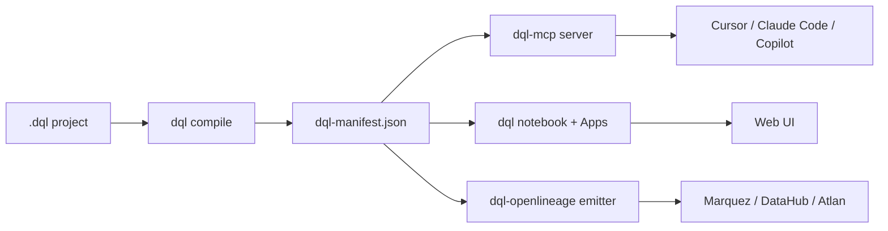

---
hide:
  - navigation
  - toc
---

# DQL

> **Analytics as code, with certification AI agents can't bypass.**

DQL is a YAML-first analytics language. You write **blocks** (a single SQL or semantic query plus its metadata), compose them into **apps** and **notebooks**, and serve only **certified** answers to AI agents through the bundled **MCP server**. Every output column traces back to its source via column-level lineage.

It's the consumption layer that pairs with [DataLex](datalex-and-dql.md): DataLex defines business contracts above dbt, dbt transforms, DQL produces certified blocks below dbt, and AI tools query through the chain.

---

## Why DQL

- **Certification with teeth.** Every certified block can pin a `datalex_contract = "<id>@<version>"`; the compiler resolves it against your DataLex manifest at compile time and the MCP refuses to serve uncertified or contract-broken blocks at runtime.
- **Column-level lineage out of the box.** Each block's compiled manifest shows every output column with its source `dbt.<model>.<column>` — feeds Marquez / DataHub / Atlan via OpenLineage with [one snapshot call](architecture/openlineage.md).
- **Built for AI agents.** The MCP server (Anthropic Model Context Protocol) exposes search, query, suggest, certify, and lineage-impact tools. Cursor, Claude Code, Copilot — they call DQL directly.
- **Apache 2.0 forever.** No closed-source language features. Hosting and multi-tenant come later in a separate commercial product; the language stays OSS.

---

## Install

=== "npm (CLI)"

    ```bash
    npm install -g @duckcodeailabs/dql-cli
    dql --help
    ```

=== "Docker quickstart"

    ```bash
    git clone https://github.com/duckcode-ai/jaffle-shop-dql.git
    cd jaffle-shop-dql
    docker compose up
    ```

=== "MCP for AI agents"

    Run the MCP server alongside your AI tool (Cursor, Claude Desktop, etc.):

    ```bash
    dql mcp serve --project /path/to/your/dql/project
    ```

---

## Five-minute path

1. **[Quickstart](01-quickstart.md)** — the minimal happy path, runnable in <5 minutes.
2. **[Concepts](02-concepts.md)** — blocks, apps, notebooks, certification, lineage.
3. **[The DataLex + DQL stack](datalex-and-dql.md)** — how the wedge works end to end.
4. **[Authoring blocks (guide)](guides/authoring-blocks.md)** — the patterns that make blocks LLM-friendly and certifiable.

---

## What ships in the box



| Package | What it does |
|---|---|
| [`@duckcodeailabs/dql-cli`](https://www.npmjs.com/package/@duckcodeailabs/dql-cli) | The `dql` binary: compile, serve, mcp, lint, fmt |
| [`@duckcodeailabs/dql-core`](https://www.npmjs.com/package/@duckcodeailabs/dql-core) | Lexer, parser, AST, semantic analyzer, manifest builder, contract registry, column-level lineage |
| [`@duckcodeailabs/dql-mcp`](https://www.npmjs.com/package/@duckcodeailabs/dql-mcp) | MCP server with 9 tools (query-via-block, search-blocks, certify, lineage-impact, …) |
| [`@duckcodeailabs/dql-lsp`](https://www.npmjs.com/package/@duckcodeailabs/dql-lsp) | LSP for `.dql` files — VS Code, Neovim, Helix |
| [`@duckcodeailabs/dql-openlineage`](https://www.npmjs.com/package/@duckcodeailabs/dql-openlineage) | Emitter for OpenLineage events; one-shot project snapshot to Marquez |

---

## Open source, in the open

[GitHub](https://github.com/duckcode-ai/dql) · [Discord](https://discord.gg/Dnm6bUvk) · [Roadmap](https://github.com/duckcode-ai/dql/blob/main/ROADMAP.md) · [Manifest spec](https://github.com/duckcode-ai/manifest-spec)

For the broader plan — DataLex pairing, the launch checklist, the federation architecture — see the [DataLex docs](https://datalex.duckcode.ai).
